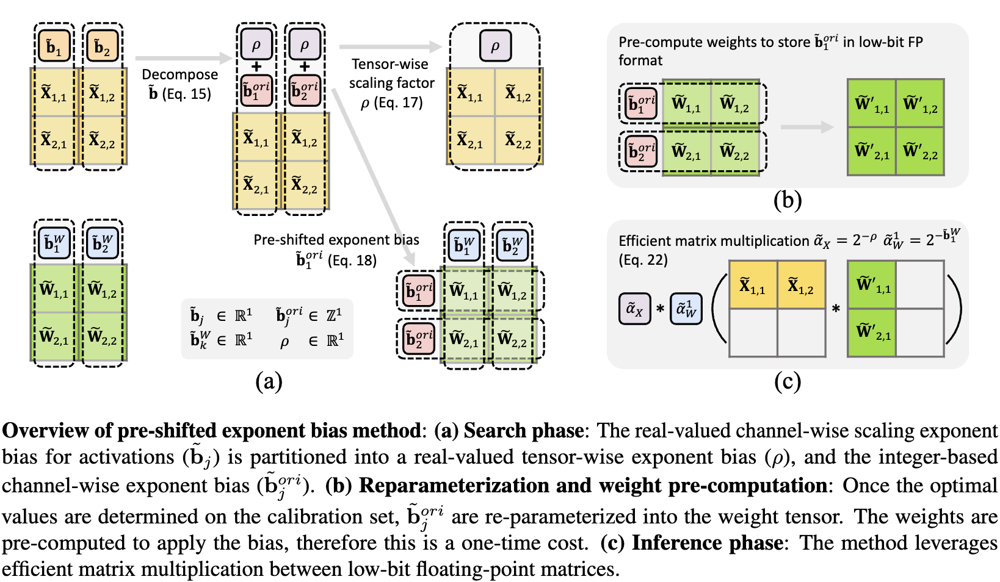

<h1 align="center">
    <p>LLM-FP4: 4-Bit Floating-Point Quantized Transformers</p>
</h1>

<h1 align="center"> 

</h1>

This is the pytorch implementation of our paper [LLM-FP4: 4-Bit Floating-Point Quantized Transformers](https://arxiv.org/abs/2310.16836), published in EMNLP 2023 main conference.
LLM-FP4 is able to quantize both weights and activations in large language models (LLMs) down to 4-bit floating-point values, in a post-training manner. The methods includes (1) a search-based framework for determining the optimal exponent bias and maximal quantization value; (2) pre-shifted exponent bias, which effectively addresses the challenge of high inter-channel variance in transformers.


## Setup

1. Install dependencies
```bash
pip install -r requirements.txt
```

2. Model Used:

```bash
MODEL_ADDR=huggyllama/llama-7b
```
```bash
MODEL_ADDR=huggyllama/llama-13b
```

## Code Structure
Refer to ./quant_layers/* for FP quantization simulation

Refer to ./utils/quant_calib.py for FP quantization calibration detail

Refer to ./complete_scripts/* for the complete scripts to reproduce the results reported in the paper

## Calibration and Evaluation (main.py)

This file contains the code to perform FP-PTQ calibration and evaluation. User can specify different quantization configuration to obtain different quantized model and evalute the quantized model with commonsense reasoning tasks.

Example usage for multiple GPUs:
```bash
export CUDA_VISIBLE_DEVICES=0,1
MODEL_ADDR=huggyllama/llama-7b
python main.py --model hf-causal-experimental --model_args pretrained=$MODEL_ADDR,use_accelerate=True \
--tasks arc_challenge,arc_easy,boolq,hellaswag,openbookqa,piqa,winogrande --device cuda --batch_size auto \
--no_cache --num_fewshot 0 --quant_config 'FPQ_config_llama' --qbits 4 4 4 2 2 2 --calib_size 32 --search_round 3 \
--search_intervals 0.01 1.2 100
```

The search results a.k.a the quantization parameters will be saved under ./search_result after the calibration is done.

## Evaluation (main.py)

To evaluate the performance of the quantized model on the commonsense reasoning tasks, first get the path of the quantization parameters and use the following command:

```bash
export CUDA_VISIBLE_DEVICES=0,1
MODEL_ADDR=huggyllama/llama-7b
python main.py --model hf-causal-experimental --model_args pretrained=$MODEL_ADDR,use_accelerate=True \
--tasks arc_challenge,arc_easy,boolq,hellaswag,openbookqa,piqa,winogrande --device cuda --batch_size auto \
--no_cache --num_fewshot 0 --quant_config 'FPQ_config_llama' --qbits 4 4 4 2 2 2 --only_eval \
--ptq_param_path "./search_result/FPQ_config_llama/W4A4E4_search_round3_search_intervals(0.01,1.2,100).pt"
```

## PTQ Result
Below is the results in LLaMA-7B and LLaMA-13B with six commonsense reasoning datasets.

| Quant Method              | #Bits (E/W/A) | #Calib |  BoolQ  |  PIQA  |  HellaSwag  |  WinoGrande  |  ARC-e  |  ARC-c  |  Average  |
|----------- |---------|--------|--------|-------------|--------------|---------|---------|--------|-----------|
|    LLaMA-7B Full-precision           | 16/16/16 | - |  75.1  |  78.7    |  56.9       | 69.9 | 75.3 |  41.9  |  66.3    |
|    MinMax INT Quant        | 4/4/4 | 32 |  54.1  |  51.7   |  25.6      | 49.8 | 24.7 |  22.9  |  38.1    |
|    MinMax FP Quant (E2M1)  | 4/4/4 | 32 |  47.3  |  53.1   |  25.7      | 50.7 | 25.1 |  22.4  |  37.4    |
|    SmoothQuant (Xiao et al., 2022) | 16/4/4 | 512 |  54.1  |  62.8   |   41.5   | 52.6 | 50.6 |  32.9  |  49.1    |
|    LLM-QAT (Liu et al., 2023) | 16/4/4 | (QAT) |  63.5  |  64.3   |   55.6   | 52.9 | 50.3 |  30.2  |  52.8    |
|    FPQ baseline | 4/4/4 | 32 |  57.4  |  56.6   |   30.2   | 51.1 | 37.7 |  23.2 |  42.7    |
|    FPQ  | 4/4/4 | 32 |  64.2  |  73.5   |   47.8   | 63.7 | 65.9 |  33.6  | **58.1**    |


| Quant Method              | #Bits (E/W/A) | #Calib |  BoolQ  |  PIQA  |  HellaSwag  |  WinoGrande  |  ARC-e  |  ARC-c  |  Average  |
|-----------------------|---------|--------|--------|-------------|--------------|---------|---------|--------|-----------|
|    LLaMA-13B Full-precision           | 16/16/16 | - |  77.9  |  79.2    |  59.9       | 72.6 | 77.4 |  46.4  |  68.9    |
|    MinMax INT Quant        | 4/4/4 | 32 |  54.5  |  52.7   |  25.5      | 51.1 | 25.3 |  22.1  |  38.5    |
|    MinMax FP Quant (E2M1)  | 4/4/4 | 32 |  45.8  |  51.7   |  25.5      | 49.5 | 25.0 |  22.8  |  36.7    |
|    SmoothQuant (Xiao et al., 2022) | 16/4/4 | 512 |  57.6  |  61.3   |   56.0   | 52.6 | 49.9 |  25.1  |  50.4    |
|    FPQ baseline | 4/4/4 | 32 |  54.3  |  57.7   |   35.7   | 52.2 | 41.1 |  25.7  |  44.5    |
|    FPQ  | 4/4/4 | 32 |  71.9  |  74.8  |   53.3   | 66.7 | 71.7 |  39.9  |  **63.1**    |

## Citing LLM-FP4

If you use LLM-FP4 in your publication, please cite it by using the following BibTeX entry.

```bibtex
@misc{liu2023llmfp4,
      title={LLM-FP4: 4-Bit Floating-Point Quantized Transformers}, 
      author={Shih-yang Liu and Zechun Liu and Xijie Huang and Pingcheng Dong and Kwang-Ting Cheng},
      year={2023},
      eprint={2310.16836},
      archivePrefix={arXiv},
      primaryClass={cs.CL}
}
```

## Acknowledgement
We greatly appreciate the contributions of three remarkable repositories: [FP8 Quantization: The Power of the Exponent](https://github.com/Qualcomm-AI-research/FP8-quantization), [PTQ4ViT](https://github.com/hahnyuan/PTQ4ViT), [Language Model Evaluation Harness](https://github.com/EleutherAI/lm-evaluation-harness). These projects have significantly benefited our work. 
